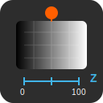
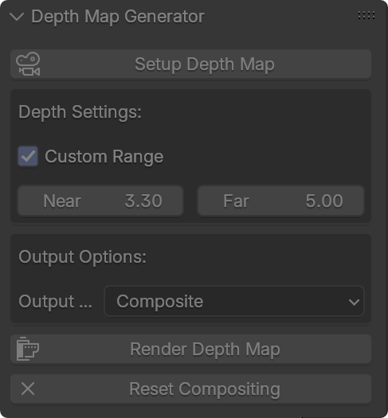

# Blender Depth Map Generator

  <table>
    <tr>
      <td align="center" width="50%">
        
      </td>
      <td align="center" width="50%">
        
      </td>
    </tr>
  </table>

A simple Blender addon that automates depth map (Z-depth) creation and rendering with a clean UI.

## Installation

1. Download `depth_map_generator.py`
2. Open Blender → Edit → Preferences → Add-ons → Install
3. Select the downloaded file and enable the addon

## Usage

1. Access the addon in the 3D Viewport sidebar (N-panel) under "Depth Map" tab
2. Click "Setup Depth Map" to configure Z-pass and compositing
3. Adjust depth range settings if needed
4. Choose output method (Composite/Viewer/File)
5. Click "Render Depth Map"

## Features

- One-click depth map setup
- Custom near/far distance controls
- Multiple output options
- Simple UI in viewport sidebar
- Easy reset functionality

## License

Apache License 2.0

---

*For issues and feature requests, please use the Issues tab*
