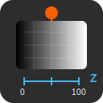
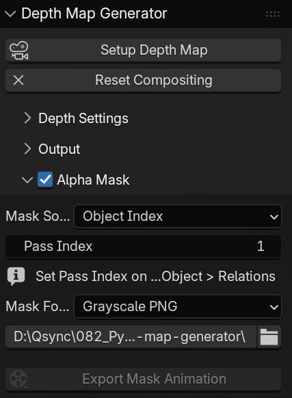

# Blender Depth Map Generator

  <table>
    <tr>
      <td align="center" width="50%">
        
      </td>
      <td align="center" width="50%">
        
      </td>
    </tr>
  </table>

A simple Blender addon that automates depth map (Z-depth) creation and rendering with a clean UI.

## Installation

1. Download `depth_map_generator.zip` from the [Releases](https://github.com/Limbicnation/blender-depth-map-generator/releases) page
2. Open Blender → Edit → Preferences → Add-ons → Install
3. Click **"Install Add-on from File..."**, select `depth_map_generator.zip`
4. Enable the **"Depth Map Generator"** addon

> **Note:** Do not extract the zip file. Blender installs directly from the zip.

## Usage

1. Access the addon in the 3D Viewport sidebar (N-panel) under "Depth Map" tab
2. Click "Setup Depth Map" to configure Z-pass and compositing
3. Adjust depth range settings if needed
4. Choose output method (Composite/Viewer/File)
5. When using File Output, you can toggle animation mode to render sequences
6. Click "Render Depth Map" or "Render Depth Animation"

## Features

- One-click depth map setup
- Custom near/far distance controls
- Depth normalization modes: LINEAR (default), LOGARITHMIC, RAW
- Alpha mask export via Object Index or Cryptomatte (Cycles only)
- 16-bit PNG output for maximum depth precision
- Contrast/brightness sliders and depth scale factor
- Multiple output options (Composite/Viewer/File)
- Animation sequence support
  - Render entire animation as depth maps
  - Use scene frame range or set custom range
  - Automatic frame numbering for sequences
- ComfyUI integration — specify input directory directly
- Simple UI in viewport sidebar
- Easy reset functionality

## License

Apache License 2.0

---

*For issues and feature requests, please use the Issues tab*
