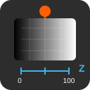
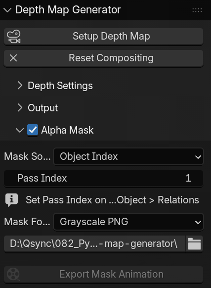

# Blender Depth Map Generator

<div align="center">
  <table>
    <tr>
      <td align="center" width="50%">
        
      </td>
      <td align="center" width="50%">
        
      </td>
    </tr>
  </table>
</div>

A Blender addon that automates depth map (Z-depth) and alpha mask rendering with a
clean viewport UI, built for feeding ComfyUI and other AI image/video workflows.

## Requirements

- **Blender 4.2+** (developed and tested against 4.5 LTS / Eevee Next)
- Works with both **Eevee Next** and **Cycles**

## Installation

1. Download `depth_map_generator.zip` from the [Releases](https://github.com/Limbicnation/blender-depth-map-generator/releases) page
2. Open Blender → Edit → Preferences → Add-ons → Install
3. Click **"Install Add-on from File..."**, select `depth_map_generator.zip`
4. Enable the **"Depth Map Generator"** addon

> **Note:** Do not extract the zip file. Blender installs directly from the zip.

## Usage

The addon lives in the 3D Viewport sidebar (**N-panel**) under the **"Depth Map"** tab.

### Depth maps

1. Click **Setup Depth Map** to enable the Z pass and build the compositing nodes
2. Adjust **Depth Settings** (normalization mode, near/far range, scale, contrast)
3. Pick an **Output** method (Composite / Viewer / File Output)
4. For File Output, optionally enable **Render Animation** for sequences
5. Click **Render Depth Map** (or **Render Depth Animation**)

### Alpha masks

1. Expand the **Alpha Mask** sub-panel and enable it
2. **Mask Source = Cryptomatte** (default, recommended) — pick the **Mask Object** to isolate
3. Click **Setup Depth Map**, then **Export Mask**

> **Eevee Next note:** Use **Cryptomatte**, not Object Index. Eevee Next never
> populates the legacy Object Index pass, so an Object Index mask comes out blank.
> Object Index remains available for Cycles users who rely on it.

## Features

- One-click depth map setup (Z pass + compositor nodes)
- Depth normalization modes: **LINEAR** (default), **LOGARITHMIC**, **RAW**
- Custom near/far distance, depth scale factor, contrast/brightness controls
- **Cryptomatte** alpha mask export — precise, anti-aliased, works in **Eevee Next and Cycles**
- Legacy **Object Index** mask mode retained for Cycles
- **OpenEXR output** for lossless precision:
  - Depth: 32-bit full float (ZIP)
  - Mask: 16-bit half float (ZIP)
- Lossless float export keeps depth precision intact for ComfyUI inputs
  (no 8/16-bit PNG quantization, no Contrast distortion on the exported data)
- Multiple output targets: Composite / Viewer / File Output
- Animation sequence support (scene or custom frame range, auto frame numbering)
- Configurable default output directories in addon Preferences
- Simple viewport UI with one-click reset

## How it works

The addon builds a `DM_`-prefixed compositor node tree:

- **Depth:** `Depth → MapRange → Contrast → ColorRamp` for the on-screen preview,
  while **File Output taps the raw `MapRange` socket** so exported depth stays
  linear and undistorted.
- **Mask (Cryptomatte):** `CryptomatteV2` (source `RENDER`, `ViewLayer.CryptoObject`
  layer, `matte_id` = chosen object name) → File Output.

All addon-owned nodes use the `DM_` prefix and are safe to remove with
**Reset Compositing**; your own nodes are left untouched.

## Development

```bash
# Lint
ruff check depth_map_generator

# Build the installable zip
python build_zip.py    # → depth_map_generator.zip
```

The addon is a Python package under `depth_map_generator/` (operators, panels,
properties, and `utils/nodes.py` for the compositor pipeline).

## License

Apache License 2.0

---

*For issues and feature requests, please use the Issues tab*
